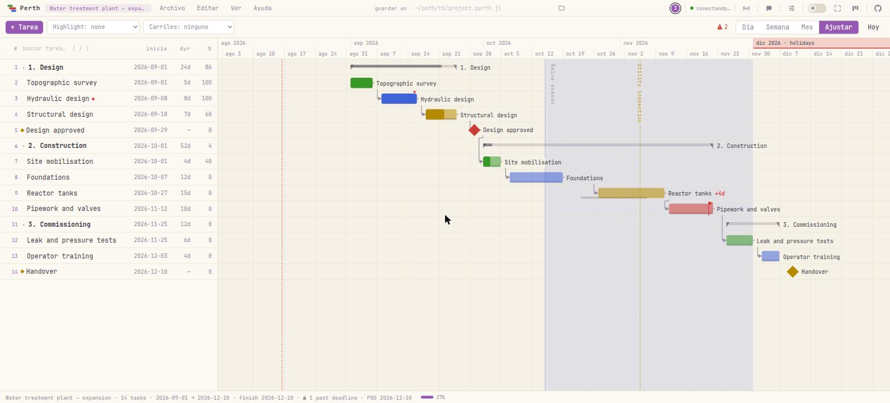

<p align="center"></p>

<h1 align="center">Perth.jl</h1>

<p align="center">
  <em>Cronogramas de proyecto, del REPL al navegador — sobre los mismos datos, en vivo.</em>
</p>

<p align="center">
  <a href="https://github.com/dantebertuzzi/Perth.jl/actions/workflows/CI.yml"></a>
  <a href="https://github.com/dantebertuzzi/Perth.jl/actions/workflows/Frontend.yml"></a>
  <a href="https://dantebertuzzi.github.io/Perth.jl/stable/"></a>
  <a href="https://github.com/dantebertuzzi/Perth.jl/releases"></a>
  
  <a href="LICENSE"></a>
</p>

<p align="center">
  <a href="README.md">English</a> ·
  <a href="README.pt-BR.md">Português</a> ·
  <b>Español</b> ·
  <a href="README.fr.md">Français</a> ·
  <a href="README.zh-CN.md">中文</a>
</p>

<p align="center"></p>

```julia
using Perth
Perth.run()          # abre http://localhost:8123 — el REPL sigue libre
```

---

## Instalación

```julia
using Pkg
Pkg.add("Perth")
```

Opcionales, reconocidos solos si se cargan **antes** de `Perth.run()`:

| Paquete | Qué añade |
|---|---|
| `BusinessDays` | calendario de días hábiles (`set_calendar!(p, "Brazil")`) |
| `QRCoders` | código QR del enlace de red, en la terminal y en la interfaz |
| `CairoMakie` (cualquier backend Makie) | `ganttplot` / `save_chart` para figuras estáticas |

---

## Sesenta segundos

```julia
using Perth

p = create_project("Planta de tratamiento — ampliación")

topo    = add_task!(p, "Levantamiento topográfico"; start = Date(2026, 9, 1), duration = 5,
                    assignee = "Ana", progress = 100)
diseno  = add_task!(p, "Diseño hidráulico"; start = Date(2026, 9, 8), duration = 8,
                    assignee = "Ana", dependencies = [topo.id],
                    notes = "Revisar la **NBR 12216** antes de dimensionar.")
aprob   = add_task!(p, "Diseño aprobado"; start = Date(2026, 9, 29), milestone = true,
                    dependencies = [diseno.id])

# un compromiso, no un plan: el plazo nunca mueve la tarea, vuelve negativa la holgura
add_task!(p, "Tuberías y válvulas"; start = Date(2026, 11, 12), duration = 10,
          deadline = Date(2026, 11, 20))

schedule!(p)                 # CPM: empuja las sucesoras a su fecha más temprana
critical_path(p)             # la cadena sin holgura
tasks(p)                     # filas Tables.jl — directo a un DataFrame

Perth.run()                  # y ahora míralo
```

Todo lo anterior también es un gesto en el navegador, y las dos direcciones son en
vivo: la página abierta nota los cambios hechos desde el REPL y se recarga sola.

> **Un detalle que conviene saber.** La variable que guardaste es una foto. Después
> de editar en el navegador, pide el proyecto otra vez — `project(id)` devuelve lo
> que la interfaz acaba de guardar, mientras `p` sigue con lo que tenía cuando lo
> asignaste.

---

## ¿Por qué un paquete de Gantt *en Julia*?

Porque el navegador es solo una de las vistas. El modelo y el motor son Julia
corriente, así que un plan es algo con lo que se calcula:

```julia
using DataFrames

df = DataFrame(tasks(p))
combine(groupby(df, :assignee), :duration => sum => :dias)

# el cronograma reacciona a tus datos, y no al revés
for fila in eachrow(mediciones)
    update_task!(p, fila.id; progress = fila.pct_hecho)
end
schedule!(p)
```

Una planilla no puede hacer eso, y un Gantt de escritorio te obliga a exportar
primero.

---

## Qué obtienes

### Planificación

| | |
|---|---|
| **Motor CPM** | `schedule!`, `critical_path`, `slack`, `project_finish` |
| **Nivelación de recursos** | `level!` — retrasa lo que tiene holgura hasta que nadie supere su capacidad diaria declarada, primero la menor holgura |
| **Dependencias** | fin-inicio por defecto; `"SS:id"`, `"FF:id"` y desfase `"id+3"` |
| **Días hábiles** | `set_calendar!(p, "Brazil")` — fines de semana y feriados dejan de contar |
| **EDT (WBS)** | dale un padre a una tarea; el padre se vuelve resumen y agrega fechas y avance |
| **Plazos** | un *compromiso*: nunca mueve la tarea, vuelve negativa su holgura y la de quien la alimenta |
| **Fecha fijada** | fecha de contrato que `schedule!` no mueve — y lo dice cuando el plan ya no cabe |
| **Línea base** | congela el plan; las barras fantasma son lo prometido, la diferencia es el desvío |
| **Orden manual** | `move_task!(p, id; parent, position)` — el orden gana a la fecha donde alguien eligió |

### El gráfico

- **Arrastra la barra** para mover la tarea, su borde derecho para redimensionar, y
  **arrastra de una barra a otra** para enlazarlas: el punto derecho enlaza con lo
  que sigue, el izquierdo con lo que viene antes. Doble clic en la flecha la quita.
- **Arrastra una fila hacia arriba o abajo** y elige el orden a mano. Soltada *en el
  hueco* entre dos filas toma esa posición; soltada *encima* de una tarea se vuelve
  subtarea suya — un gesto, dos destinos. La columna **`#`** es ese orden escrito; su
  tooltip trae el id de la tarea.
- **Zoom día / semana / mes / ajustar** (`1`–`4`) y **Ctrl+rueda**, que mantiene
  quieta la fecha bajo el puntero. Cambiar el zoom nunca te teletransporta a hoy.
- **Días marcados** — doble clic en una columna de la regla y ponle nombre: una línea
  vertical que cruza el gráfico, para la fecha que importa a todas las tareas.
- **Meses marcados** — el mes entero pintado en la regla de arriba. Dicho una vez,
  allí, en lugar de repetido en cada tarea de adentro.
- **Bandas de calendario** — sombrea un tramo con nombre detrás del gráfico: un
  sprint, una parada, la temporada de lluvias. Es anotación, nunca programación.
- **Carriles** por persona o equipo, **resúmenes plegables** (y lo que plegaste
  sobrevive a la recarga), **filtro de resaltado** — que atenúa lo que no
  coincide, o lo oculta del todo (*Solo estos*, `O`) cuando el plan ya es lo
  bastante largo como para que pasar por el gris sea la mayor parte de la
  lectura — y **modo presentación**.
- **Notas con markdown**: el punto rojo abre la nota y renderiza `**negrita**`,
  `*cursiva*`, `` `código` ``, `~~tachado~~` y enlaces.
- Nada en el gráfico se escribe encima de nada: las líneas abren un hueco donde
  cruzan una etiqueta, y los nombres de costado buscan altura libre. Hay una prueba
  que lo mide, en un navegador de verdad, en cuatro zooms y dos densidades.

### Leer el plan

| | |
|---|---|
| **Curva S** | previsto × realizado — la distancia es el atraso medido en trabajo, no en días |
| **Carga** | cuánto tiene cada persona cada día (`workload`, `overallocations`) |
| **Capacidad** | `add_person!(p, "Ana"; capacity = 8)` y `effort` en la tarea: la sobrecarga pasa a ser *más trabajo del que cabe en el día*, no *dos tareas el mismo día* |
| **Estadísticas** | por persona y por equipo: esfuerzo, hecho, días ocupados, días duplicados |
| **Avisos** | ciclo de dependencia · plazo vencido · vencida · sobrecarga · atrás de la línea base · *empieza antes de lo que permiten sus dependencias* |
| **Glosario** | Ayuda → *Qué quieren decir las palabras*: holgura, ruta crítica, línea base, P80 |

### Sacarlo afuera

Exporta el proyecto (`.perth.jl`), las tareas (**CSV**), los hitos y plazos
(**iCalendar**), el gráfico (**PNG**) o una figura estática con Makie (`ganttplot`,
`save_chart`). Y el **espejo en archivo**: apunta el proyecto a una ruta y cada
guardado reescribe el `.perth.jl` allí — `git diff` muestra qué cambió en el plan.

**Y de vuelta hacia dentro.** Un CSV también entra — *Archivo → Importar*, o
`add_tasks!(p, "plan.csv")` en el REPL, sin ningún paquete de CSV que instalar. Una
fila por tarea, una columna `name`, y lo demás que tengas; `parent` y `dependencies`
pueden citar la tarea por **nombre**, así que la planilla que alguien escribió de
verdad entra tan bien como el archivo que Perth exportó.

---

## Compartir un plan

Por defecto `Perth.run()` solo es alcanzable desde esta máquina. Compartir es un
**interruptor en vivo**, no una decisión de arranque — desde el REPL, desde el botón
de transmitir en la barra de menús, o en *Archivo → Share / QR…*:

```julia
Perth.run(share = true)          # imprime los enlaces de la red (+ QR con QRCoders)
Perth.share!()                   # empieza a transmitir con el servidor ya arriba
Perth.share!(false)              # detiene; los navegadores remotos caen al instante
Perth.key!("obra-2026")          # exige una clave de acceso a quien viene de la red
```

Cada máquina conectada aparece como un cursor etiquetado con su nombre e IP, al
estilo de programación en pareja, y hay un chat en la esquina.

### Un enlace que solo muestra

Compartir era todo o nada: quien abría el enlace editaba. `view_key` es una
**segunda clave** que da lectura y niega escritura — el enlace que le mandas a un
cliente, a una dirección, a toda la obra:

```julia
Perth.run(share = true, key = "obra-2026", view_key = "obra-2026-ver")
Perth.view_key!("solo-mirar")     # cámbialo, en vivo
Perth.view_key!()                 # termínalo
```

Quien niega es el **servidor**, decidiendo **por el método** y no por una lista de
rutas: una ruta añadida mañana nace negada. Incluso la puerta que la interfaz no usa
— el chat del WebSocket persiste en disco y llega a todos, así que es escritura, y
dejarlo abierto sería cambiar la cerradura y dejar la ventana abierta. Quien entra
por el enlace de lectura aparece entre las máquinas conectadas como un anillo hueco:
presente, sin escribir.

> **Seguridad.** Sin clave, cualquiera en la red que sepa el puerto abre y edita
> todos los proyectos. El enlace de solo lectura limita lo que un navegador puede
> hacer; no es un inicio de sesión, y es tan privado como la red en la que está.
> Nunca expongas el puerto a internet.

<details>
<summary><b>Abrir el puerto en el firewall (Windows, redes corporativas)</b></summary>

Transmitir solo sirve si la máquina acepta conexiones entrantes en el puerto (8123
en el Gantt, 8150 en el kanban). En orden de esfuerzo:

1. **Aviso del primer arranque** — Windows Defender pregunta por `julia.exe`; marca
   **Redes privadas** y *Permitir acceso*. Requiere permisos de administrador, así
   que en una máquina bloqueada puede salir en gris o no aparecer.
2. **Si se descartó** — menú Inicio → "Permitir una aplicación a través del Firewall"
   → *Cambiar configuración* → *Permitir otra aplicación…* → apunta a `julia.exe`
   (ejecuta `Sys.BINDIR` en el REPL para hallarlo) y marca *Privada*.
3. **Una regla explícita**, que es lo que TI suele preferir — PowerShell como
   administrador:
   ```powershell
   New-NetFirewallRule -DisplayName "Perth" -Direction Inbound `
     -Protocol TCP -LocalPort 8123 -Action Allow -Profile Domain,Private
   ```
4. **Revisa el perfil de red.** Una regla *Privada* no hace nada si Windows clasificó
   la red de la oficina como *Pública*. En máquinas de dominio la red de la oficina
   suele ser *Dominio*, que la regla de arriba ya cubre.
5. **Sin administrador** — mándale a TI una línea: *"Permitir TCP entrante en el
   puerto 8123 para `julia.exe` (perfil Dominio/Privada, solo LAN — un plan interno
   en `http://<mi-ip>:8123`; nada expuesto a internet)."*
6. **¿Firewall abierto y sigue inalcanzable?** El Wi-Fi de invitados suele tener
   *aislamiento de clientes*. Prueba con `Test-NetConnection <ip> -Port 8123`; si
   falla con el firewall abierto, usa la red cableada o la de personal.

En Linux: `sudo ufw allow 8123/tcp`. macOS avisa en el primer arranque, como Windows.

</details>

---

## Estimar bajo incertidumbre (PERT)

Un solo número para una duración es una corazonada de traje. Da tres:

```julia
set_estimate!(p, cimentacion.id, 9, 12, 22)   # optimista, más probable, pesimista

pert(p)                                       # duración esperada y σ, por tarea
pert_finish(p)                                # término: esperado, σ, P10/P50/P80/P90
finish_probability(p, Date(2026, 12, 10))     # la probabilidad de la fecha prometida
pert_date(p, 0.8)                             # la fecha que aciertas 4 de cada 5 veces
pert!(p)                                      # aplica (o + 4m + p)/6 como duración
```

Las estimaciones no mueven nada por sí solas — quien las escribe en el plan es
`pert!`, igual que quien mueve fechas es `schedule!`.

### El número que la fórmula no cuenta

El PERT analítico supone una sola cadena crítica. Cuando varias cadenas miden casi
lo mismo, la que se atrase se vuelve crítica — y el término se corre más allá de lo
que cualquier fórmula predice. `pert_simulate` corre el motor entero miles de veces:

```julia
sim = pert_simulate(p; n = 10_000)
sim.p80        # la fecha que sobrevive al 80% de los futuros
```

La diferencia entre `pert_finish(p).p80` y `sim.p80` es el precio de fingir que solo
hay una ruta crítica.

---

## Kanban: un tablero compartido para la oficina

`Perth.kanban()` levanta una segunda aplicación, independiente. No toca el modelo de
datos del Gantt — el tablero es una entidad propia, persistida como `kanban.json` en
el directorio de datos.

```julia
Perth.kanban()                         # solo esta máquina, como Perth.run()
Perth.kanban(share = true)             # imprime los enlaces de la red
Perth.kanban(share = true, key = "…")  # …y exige la clave a quien venga de ella
Perth.kanban_share!(false)             # deja de transmitir, el tablero sigue arriba
Perth.kanban_key!("…")                 # fija/cambia la clave con el tablero corriendo

kanban_from_project!(p)                # convierte un plan en tarjetas
```

Autoridad en el WebSocket de punta a punta: cada cambio se transmite en vivo,
arrastrar una tarjeta se anima en la pantalla de todos, y cada máquina aparece como
un cursor etiquetado anclado a una *tarjeta*, no a un píxel — así sobrevive a
tamaños de ventana y niveles de zoom distintos. Las tarjetas llevan `#etiquetas`,
`**markdown**`, checklist, fecha límite, responsable, **límite de WIP** por columna y
archivo; una tarjeta enlazada arrastrada a *done* completa la tarea en el Gantt, y al
revés. Una tarjeta también **se abre como documento** (`Shift+Enter`, o desde el editor
de la propia tarjeta — una tableta no tiene Shift): una
descripción con listas y bloques de código, y capturas pegadas directamente con
`Ctrl+V` — reducidas en el navegador, guardadas junto al tablero y direccionadas por
contenido, así que la misma imagen pegada cinco veces es un solo archivo.
`Ctrl+Z` / `Ctrl+Shift+Z` deshacen lo **tuyo**, sin revertir lo que un colega
hizo después.

El **anfitrión** puede restringir qué hace cada máquina — *Board → Permissions…* es
una matriz de 21 acciones de tarjeta y columna contra cada IP que se haya conectado.
Se aplica **en el servidor**: el cliente no la esquiva hablando directo con el
WebSocket, y la interfaz solo esconde lo negado.

Y el REPL opera sobre el mismo tablero, transmitiendo en vivo a todos los navegadores:

```julia
kanban_add_card!("backlog", "Publicar la v1.0")
kanban_move_card!(id, "doing")
kanban_alias!("192.168.0.23", "Paulo")   # un nombre para la máquina, para todos
kanban_cards() |> DataFrame              # filas (columna, id, texto)
kanban_log()                             # quién cambió qué, y cuándo
kanban_chat!("tablero listo")            # el panel de chat, desde el REPL
Perth.kanban_stop()
```

> **Seguridad.** La matriz de permisos restringe lo que una máquina **conectada**
> puede hacer; no bloquea la conexión, y la identidad es solo una dirección IP
> (falsificable en una red en la que no confías). Tómala como reducción de daño, no
> como autenticación.

<details>
<summary><b>Reiniciar el tablero</b></summary>

El tablero entero vive en dos archivos, así que reiniciarlo es: parar el servidor,
borrarlos, arrancar de nuevo.

```julia
Perth.kanban_stop()                       # para primero — el servidor mantiene el
                                          # tablero en memoria y reescribe el archivo
                                          # en cada operación
datadir = joinpath(homedir(), ".perth")   # o tu PERTH_DATA_DIR / data_dir
rm(joinpath(datadir, "kanban.json"); force = true)        # el tablero
rm(joinpath(datadir, "kanban-log.jsonl"); force = true)   # el registro de actividad
Perth.kanban(share = true)                # tablero nuevo: backlog / doing / done
```

Borrar el registro es opcional — pero si lo conservas, el panel de Actividad mostrará
historia de un tablero que ya no existe. Para **guardar** el tablero viejo en vez de
borrarlo, renombra el archivo y devuélvele el nombre cuando quieras; para empezar un
tablero **aparte** sin tocar este, apunta el servidor a otra carpeta:
`Perth.kanban(share = true, data_dir = "/ruta/al/nuevo-tablero")`.

</details>

---

## Teclado

| | |
|---|---|
| `↑` `↓` | mueve la selección por las filas visibles |
| `←` `→` | pliega un resumen / lo abre — en una hoja, `←` sube al padre |
| `Home` `End` · `PageUp` `PageDown` | extremos del plan · una pantalla |
| `N` · `Enter` · `Del` · `Ctrl+D` | nueva · editar · borrar · duplicar la selección |
| `Ctrl+clic` · `Shift+clic` · `Shift+↑` `↓` | sumar una a la selección · tomar el rango · extenderlo |
| `Ctrl+A` · `Ctrl+E` | seleccionar todas las visibles · editar la selección (fechas, responsable, color) |
| `Ctrl+Z` · `Ctrl+Shift+Z` | deshacer · rehacer |
| `S` · `C` · `R` | programar automáticamente · ruta crítica · recursos |
| `1` `2` `3` `4` · `Ctrl+rueda` | zoom día / semana / mes / ajustar · zoom bajo el puntero |
| `T` · `/` · `D` · `P` | ir a hoy · buscar tarea · modo oscuro · presentación |

---

## Dónde vive todo

Cada proyecto es un archivo JSON en `~/.perth` (o `$PERTH_DATA_DIR`, o
`Perth.run(data_dir = ...)`). JSON es el formato de la máquina; **`.perth.jl` es el
formato de intercambio para personas y control de versiones**:

```julia
Perth.save(p, "planes/planta.perth.jl")        # fuente Julia legible y diffable
q = Perth.load("planes/planta.perth.jl")
set_file_path!(p, "planes/planta.perth.jl")    # espejo: cada guardado lo reescribe
```

`Perth.load` usa un **lector restringido**, no `eval`: solo pueden construirse
`Project`, `GanttTask`, `Person`, `Band`, `Marker`, `MonthMark`, `Date` y `DateTime`,
y cualquier otra llamada se rechaza. Un plan que te llegó por correo no ejecuta
código.

---

## Arquitectura

```
REPL  ──►  AppState (proyectos en memoria + contador de revisión)  ◄──  API HTTP
                     │                                                    │
              JSON en disco                             navegador (JS puro)
              espejo .perth.jl                          + presencia por WebSocket
```

Sin framework, sin paso de build, sin `node_modules`: el frontend es JS y CSS puros
servidos por el mismo proceso Julia. Tres suites lo mantienen honesto — Julia
(`Pkg.test()`), jsdom para la lógica del DOM, y un Chrome sin interfaz de verdad para
geometría, cadenas de eventos y medición de superposiciones.

---

## Limitaciones conocidas

- **No es multiusuario por identidad.** Todos en la red comparten los mismos
  proyectos; la clave de acceso es una puerta, no un inicio de sesión.
- **Local por diseño.** Sin nube, sin cuentas, sin sincronización entre máquinas más
  allá de la LAN — el archivo es la sincronización.
- **La nivelación es una heurística, y necesita capacidad declarada.** `level!` mueve
  primero las tareas con más holgura — una regla defendible, no el óptimo, porque el
  óptimo es NP-difícil. Solo toca a quien tiene `capacity` declarada, y un plan con más
  trabajo que capacidad vuelve con los días que siguen sin caber marcados, en lugar de
  reordenado en silencio.

Lo que viene está en [ROADMAP.md](ROADMAP.md), con el razonamiento de cada punto.
Issues y contribuciones son bienvenidas — incluso contarme que un plan tuyo rompió
algo.

---

<p align="center">
  <a href="CHANGELOG.md">Changelog</a> ·
  <a href="ROADMAP.md">Roadmap</a> ·
  <a href="https://dantebertuzzi.github.io/Perth.jl/stable/">Documentación</a> ·
  MIT
</p>
