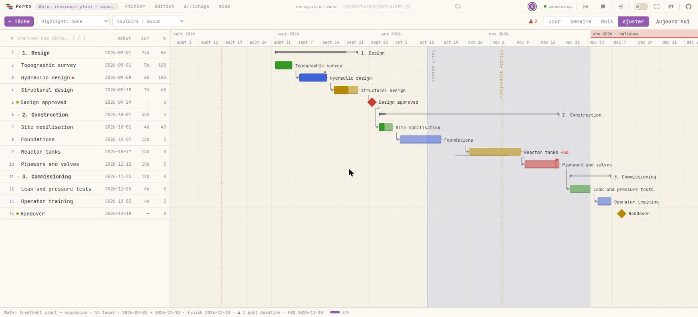

<p align="center"></p>

<h1 align="center">Perth.jl</h1>

<p align="center">
  <em>Des plannings de projet, du REPL au navigateur — sur les mêmes données, en direct.</em>
</p>

<p align="center">
  <a href="https://github.com/dantebertuzzi/Perth.jl/actions/workflows/CI.yml"></a>
  <a href="https://github.com/dantebertuzzi/Perth.jl/actions/workflows/Frontend.yml"></a>
  <a href="https://dantebertuzzi.github.io/Perth.jl/stable/"></a>
  <a href="https://github.com/dantebertuzzi/Perth.jl/releases"></a>
  
  <a href="LICENSE"></a>
</p>

<p align="center">
  <a href="README.md">English</a> ·
  <a href="README.pt-BR.md">Português</a> ·
  <a href="README.es.md">Español</a> ·
  <b>Français</b> ·
  <a href="README.zh-CN.md">中文</a>
</p>

<p align="center"></p>

```julia
using Perth
Perth.run()          # ouvre http://localhost:8123 — le REPL reste libre
```

---

## Installation

```julia
using Pkg
Pkg.add("Perth")
```

Optionnels, pris en compte tout seuls s'ils sont chargés **avant** `Perth.run()` :

| Paquet | Ce qu'il ajoute |
|---|---|
| `BusinessDays` | calendrier de jours ouvrés (`set_calendar!(p, "Brazil")`) |
| `QRCoders` | un QR code du lien réseau, dans le terminal et dans l'interface |
| `CairoMakie` (n'importe quel backend Makie) | `ganttplot` / `save_chart` pour des figures statiques |

---

## Soixante secondes

```julia
using Perth

p = create_project("Station d'épuration — extension")

leve    = add_task!(p, "Levé topographique"; start = Date(2026, 9, 1), duration = 5,
                    assignee = "Ana", progress = 100)
etude   = add_task!(p, "Étude hydraulique"; start = Date(2026, 9, 8), duration = 8,
                    assignee = "Ana", dependencies = [leve.id],
                    notes = "Vérifier la **NBR 12216** avant de dimensionner.")
valide  = add_task!(p, "Étude validée"; start = Date(2026, 9, 29), milestone = true,
                    dependencies = [etude.id])

# un engagement, pas un plan : l'échéance ne déplace jamais la tâche, elle rend la marge négative
add_task!(p, "Tuyauterie et vannes"; start = Date(2026, 11, 12), duration = 10,
          deadline = Date(2026, 11, 20))

schedule!(p)                 # CPM : pousse les successeurs à leur date au plus tôt
critical_path(p)             # la chaîne sans marge
tasks(p)                     # lignes Tables.jl — directement dans un DataFrame

Perth.run()                  # et maintenant, regardez
```

Tout ce qui précède est aussi un geste dans le navigateur, et les deux sens sont en
direct : la page ouverte remarque les changements faits depuis le REPL et se
recharge d'elle-même.

> **Un détail à connaître.** La variable que vous avez gardée est un instantané.
> Après une modification dans le navigateur, redemandez le projet — `project(id)`
> renvoie ce que l'interface vient d'enregistrer, tandis que `p` contient encore ce
> qu'il contenait au moment de l'affectation.

---

## Pourquoi un paquet Gantt *en Julia* ?

Parce que le navigateur n'est qu'une des vues. Le modèle et le moteur sont du Julia
ordinaire : un planning devient donc quelque chose avec quoi on calcule.

```julia
using DataFrames

df = DataFrame(tasks(p))
combine(groupby(df, :assignee), :duration => sum => :jours)

# le planning réagit à vos données, et non l'inverse
for ligne in eachrow(releves)
    update_task!(p, ligne.id; progress = ligne.pct_fait)
end
schedule!(p)
```

Un tableur ne sait pas faire ça, et un Gantt de bureau vous oblige à exporter
d'abord.

---

## Ce que vous obtenez

### Planification

| | |
|---|---|
| **Moteur CPM** | `schedule!`, `critical_path`, `slack`, `project_finish` |
| **Dépendances** | fin-début par défaut ; `"SS:id"`, `"FF:id"` et décalage `"id+3"` |
| **Jours ouvrés** | `set_calendar!(p, "Brazil")` — week-ends et jours fériés cessent de compter |
| **WBS (OTP)** | donnez un parent à une tâche ; le parent devient un récapitulatif qui agrège dates et avancement |
| **Échéances** | un *engagement* : ne déplace jamais la tâche, rend négative sa marge et celle de ce qui l'alimente |
| **Date fixée** | une date contractuelle que `schedule!` laisse en place — et le dit quand le plan n'y tient plus |
| **Ligne de base** | gelez le plan ; les barres fantômes sont ce qui a été promis, l'écart est le glissement |
| **Ordre manuel** | `move_task!(p, id; parent, position)` — l'ordre l'emporte sur la date là où quelqu'un a choisi |

### Le graphique

- **Faites glisser une barre** pour déplacer une tâche, son bord droit pour la
  redimensionner, et **glissez d'une barre à l'autre** pour les lier : le point de
  droite lie à ce qui suit, celui de gauche à ce qui précède. Double-clic sur une
  flèche pour la retirer.
- **Faites glisser une ligne vers le haut ou le bas** pour ordonner le plan à la
  main. Lâchée *dans l'espace* entre deux lignes, elle prend cette position ; lâchée
  *sur* une tâche, elle en devient une sous-tâche — un geste, deux destinations. La
  colonne **`#`** est cet ordre écrit ; son infobulle porte l'id de la tâche.
- **Zoom jour / semaine / mois / ajuster** (`1`–`4`) et **Ctrl+molette**, qui garde
  en place la date sous le pointeur. Changer de zoom ne vous téléporte plus à
  aujourd'hui.
- **Jours marqués** — double-cliquez une colonne de la règle et nommez-la : une
  ligne verticale traversant tout le graphique, pour une date qui compte pour toutes
  les tâches à la fois.
- **Mois marqués** — un mois entier peint dans la règle en haut. Dit une fois,
  là-haut, au lieu d'être répété sur chaque tâche à l'intérieur.
- **Bandes de calendrier** — ombrez une portion nommée derrière le graphique : un
  sprint, un arrêt, la saison des pluies. C'est une annotation, jamais de la
  planification.
- **Couloirs** par personne ou par équipe, **récapitulatifs repliables** (et ce que
  vous avez replié survit au rechargement), **filtre de mise en évidence** et **mode
  présentation**.
- **Notes en markdown** : le point rouge ouvre la note et rend `**gras**`,
  `*italique*`, `` `code` ``, `~~barré~~` et les liens.
- Rien sur le graphique n'est écrit par-dessus autre chose : les lignes ouvrent un
  espace là où elles croisent une étiquette, et les noms couchés cherchent une
  hauteur libre. Un test le mesure, dans un vrai navigateur, à quatre zooms et deux
  densités.

### Lire le plan

| | |
|---|---|
| **Courbe en S** | prévu × réalisé — l'écart est le retard mesuré en travail, pas en jours |
| **Charge** | ce que chaque personne a chaque jour (`workload`, `overallocations`) |
| **Capacité** | `add_person!(p, "Ana"; capacity = 8)` et `effort` sur la tâche : la surcharge devient *plus de travail que le jour n'en contient*, et non *deux tâches le même jour* |
| **Statistiques** | par personne et par équipe : effort, fait, jours occupés, jours en double |
| **Avertissements** | cycle de dépendance · délai dépassé · en retard · surcharge · derrière la ligne de base · *commence avant ce que ses dépendances permettent* |
| **Glossaire** | Aide → *Ce que veulent dire les mots* : marge, chemin critique, ligne de base, P80 |

### En faire sortir quelque chose

Exportez le projet (`.perth.jl`), les tâches (**CSV**), les jalons et échéances
(**iCalendar**), le graphique (**PNG**), ou une figure statique via Makie
(`ganttplot`, `save_chart`). Et le **miroir fichier** : pointez un projet vers un
chemin et chaque enregistrement y réécrit le `.perth.jl` — `git diff` montre alors ce
qui a changé dans le plan.

---

## Partager un plan

Par défaut, `Perth.run()` n'est joignable que depuis cette machine. Le partage est un
**interrupteur en direct**, pas une décision de démarrage — depuis le REPL, depuis le
bouton de diffusion de la barre de menus, ou dans *Fichier → Share / QR…* :

```julia
Perth.run(share = true)          # affiche les liens du réseau (+ un QR code avec QRCoders)
Perth.share!()                   # démarre la diffusion, serveur déjà lancé
Perth.share!(false)              # arrête ; les navigateurs distants tombent aussitôt
Perth.key!("chantier-2026")      # exige une clé d'accès de ceux qui viennent du réseau
```

Chaque machine connectée apparaît comme un curseur étiqueté avec son nom et son IP,
façon programmation en binôme, et il y a un chat dans le coin.

### Un lien qui ne fait que montrer

Le partage était tout ou rien : qui ouvrait le lien pouvait modifier. `view_key` est
une **deuxième clé** qui accorde la lecture et refuse l'écriture — le lien que vous
envoyez à un client, à une direction, à tout le chantier :

```julia
Perth.run(share = true, key = "chantier-2026", view_key = "chantier-2026-vue")
Perth.view_key!("juste-regarder")  # changez-le, en direct
Perth.view_key!()                  # supprimez-le
```

Celui qui refuse, c'est le **serveur**, en décidant **par la méthode** et non par une
liste de routes : une route ajoutée demain est refusée d'office. Y compris la porte
que l'interface n'utilise pas — le chat de la socket de présence persiste sur disque
et atteint tout le monde, c'est donc de l'écriture, et la laisser ouverte reviendrait
à changer la serrure en laissant la fenêtre ouverte. Ceux qui entrent par le lien de
lecture apparaissent parmi les machines connectées comme un anneau creux : présents,
sans écrire.

> **Sécurité.** Sans clé, quiconque sur le réseau connaît le port ouvre et modifie
> tous les projets. Un lien en lecture seule limite ce qu'un navigateur peut faire ;
> ce n'est pas une authentification, et il est aussi privé que le réseau où il se
> trouve. N'exposez jamais le port à Internet.

<details>
<summary><b>Ouvrir le port du pare-feu (Windows, réseaux d'entreprise)</b></summary>

Le partage ne sert que si la machine accepte les connexions entrantes sur le port
(8123 pour le Gantt, 8150 pour le kanban). Par ordre d'effort :

1. **Invite au premier lancement** — Windows Defender demande pour `julia.exe` ;
   cochez **Réseaux privés** et *Autoriser l'accès*. Cela demande des droits
   d'administrateur : sur une machine verrouillée, l'invite peut être grisée ou ne
   jamais apparaître.
2. **Si elle a été rejetée** — menu Démarrer → « Autoriser une application via le
   Pare-feu » → *Modifier les paramètres* → *Autoriser une autre application…* →
   pointez `julia.exe` (lancez `Sys.BINDIR` dans le REPL pour le trouver) et cochez
   *Privé*.
3. **Une règle explicite**, ce que la DSI préfère en général — PowerShell en
   administrateur :
   ```powershell
   New-NetFirewallRule -DisplayName "Perth" -Direction Inbound `
     -Protocol TCP -LocalPort 8123 -Action Allow -Profile Domain,Private
   ```
4. **Vérifiez le profil réseau.** Une règle *Privé* ne fait rien si Windows a classé
   le réseau du bureau en *Public*. Sur une machine du domaine, le réseau du bureau
   est généralement *Domaine*, que la règle ci-dessus couvre déjà.
5. **Aucun droit d'administrateur** — envoyez une ligne à la DSI : « Autoriser le TCP
   entrant sur le port 8123 pour `julia.exe` (profil Domaine/Privé, LAN uniquement —
   un plan interne sur `http://<mon-ip>:8123` ; rien n'est exposé à Internet). »
6. **Pare-feu ouvert et toujours injoignable ?** Le Wi-Fi invité a souvent
   l'*isolation des clients*. Testez avec `Test-NetConnection <ip> -Port 8123` ; si
   cela échoue pare-feu ouvert, passez par le réseau filaire ou celui du personnel.

Sous Linux : `sudo ufw allow 8123/tcp`. macOS affiche une invite au premier
lancement, comme Windows.

</details>

---

## Estimer dans l'incertitude (PERT)

Un seul chiffre pour une durée, c'est une intuition en costume. Donnez-en trois :

```julia
set_estimate!(p, fondations.id, 9, 12, 22)    # optimiste, la plus probable, pessimiste

pert(p)                                       # durée attendue et σ, par tâche
pert_finish(p)                                # fin : attendue, σ, P10/P50/P80/P90
finish_probability(p, Date(2026, 12, 10))     # les chances de la date promise
pert_date(p, 0.8)                             # la date juste 4 fois sur 5
pert!(p)                                      # applique (o + 4m + p)/6 comme durée
```

Les estimations ne déplacent rien d'elles-mêmes — c'est `pert!` qui les écrit dans le
plan, de la même façon que c'est `schedule!` qui déplace les dates.

### Le nombre que la formule ne dira pas

Le PERT analytique suppose une seule chaîne critique. Quand plusieurs chaînes font
presque la même longueur, celle qui prend du retard devient la critique — et la fin
glisse plus loin que ce que n'importe quelle formule prédit. `pert_simulate` fait
tourner le moteur entier des milliers de fois :

```julia
sim = pert_simulate(p; n = 10_000)
sim.p80        # la date qui survit à 80 % des futurs
```

L'écart entre `pert_finish(p).p80` et `sim.p80` est le prix de faire comme s'il n'y
avait qu'un seul chemin critique.

---

## Kanban : un tableau partagé pour le bureau

`Perth.kanban()` lance une seconde application, indépendante. Elle ne touche pas au
modèle de données du Gantt — le tableau est une entité à part, persistée dans
`kanban.json` au sein du répertoire de données.

```julia
Perth.kanban()                         # cette machine seulement, comme Perth.run()
Perth.kanban(share = true)             # affiche les liens du réseau
Perth.kanban(share = true, key = "…")  # …et exige la clé de ceux qui en viennent
Perth.kanban_share!(false)             # arrête la diffusion, le tableau reste en vie
Perth.kanban_key!("…")                 # définit/change la clé, tableau lancé

kanban_from_project!(p)                # transforme un plan en cartes
```

Autorité WebSocket de bout en bout : chaque changement est diffusé en direct, faire
glisser une carte s'anime sur l'écran de tout le monde, et chaque machine apparaît
comme un curseur étiqueté ancré à une *carte*, pas à un pixel — il survit donc aux
tailles de fenêtre et aux niveaux de zoom différents. Les cartes portent des
`#étiquettes`, du `**markdown**`, des check-lists, des échéances, des responsables,
des **limites d'en-cours** par colonne et une archive ; une carte liée déposée dans
*done* termine la tâche dans le Gantt, et réciproquement. Une carte **s'ouvre aussi
comme un document** (`Shift+Entrée`, ou depuis l'éditeur de la carte — une
tablette n'a pas de touche Shift) : une description avec listes et blocs
de code, et des captures collées directement au `Ctrl+V` — réduites dans le
navigateur, rangées à côté du tableau et adressées par leur contenu, si bien que la
même image collée cinq fois ne fait qu'un fichier. `Ctrl+Z` / `Ctrl+Shift+Z`
annulent **vos** actions sans revenir sur ce qu'un collègue a fait ensuite.

L'**hôte** peut restreindre ce qu'une machine a le droit de faire — *Board →
Permissions…* est une matrice de 21 actions de carte et de colonne face à chaque IP
qui s'est connectée. C'est appliqué **côté serveur** : un client ne la contourne pas
en parlant directement à la WebSocket, et l'interface se contente de masquer ce qui
est refusé.

Et le REPL agit sur le même tableau, en diffusant en direct à tous les navigateurs :

```julia
kanban_add_card!("backlog", "Publier la v1.0")
kanban_move_card!(id, "doing")
kanban_alias!("192.168.0.23", "Paulo")   # un nom pour la machine, pour tout le monde
kanban_cards() |> DataFrame              # lignes (colonne, id, texte)
kanban_log()                             # qui a changé quoi, et quand
kanban_chat!("le tableau est prêt")      # le panneau de chat, depuis le REPL
Perth.kanban_stop()
```

> **Sécurité.** La matrice de permissions restreint ce qu'une machine **connectée**
> peut faire ; elle ne filtre pas la connexion, et l'identité n'est qu'une adresse IP
> (usurpable sur un réseau non fiable). Voyez-la comme une réduction des dégâts, pas
> comme une authentification.

<details>
<summary><b>Réinitialiser le tableau</b></summary>

Le tableau entier tient dans deux fichiers : une réinitialisation complète consiste à
arrêter le serveur, les supprimer, puis relancer.

```julia
Perth.kanban_stop()                       # arrêtez d'abord — le serveur garde le
                                          # tableau en mémoire et réécrit le fichier
                                          # à chaque opération
datadir = joinpath(homedir(), ".perth")   # ou votre PERTH_DATA_DIR / data_dir
rm(joinpath(datadir, "kanban.json"); force = true)        # le tableau
rm(joinpath(datadir, "kanban-log.jsonl"); force = true)   # le journal d'activité
Perth.kanban(share = true)                # tableau neuf : backlog / doing / done
```

Supprimer le journal est facultatif — mais si vous le gardez, le panneau Activité
montrera l'histoire d'un tableau qui n'existe plus. Pour **conserver** l'ancien
tableau au lieu de l'effacer, renommez le fichier et remettez son nom quand vous le
voudrez ; pour démarrer un tableau **séparé** sans toucher à celui-ci, pointez le
serveur vers un autre dossier :
`Perth.kanban(share = true, data_dir = "/chemin/vers/nouveau-tableau")`.

</details>

---

## Clavier

| | |
|---|---|
| `↑` `↓` | déplace la sélection dans les lignes visibles |
| `←` `→` | replie un récapitulatif / l'ouvre — sur une feuille, `←` remonte au parent |
| `Home` `End` · `PageUp` `PageDown` | extrémités du plan · un écran |
| `N` · `Enter` · `Suppr` · `Ctrl+D` | nouvelle · modifier · supprimer · dupliquer la sélection |
| `Ctrl+clic` · `Shift+clic` · `Shift+↑` `↓` | ajouter à la sélection · prendre l'intervalle · l'étendre |
| `Ctrl+A` · `Ctrl+E` | tout sélectionner · modifier la sélection (dates, responsable, couleur) |
| `Ctrl+Z` · `Ctrl+Shift+Z` | annuler · rétablir |
| `S` · `C` · `R` | planifier automatiquement · chemin critique · charge |
| `1` `2` `3` `4` · `Ctrl+molette` | zoom jour / semaine / mois / ajuster · zoom sous le pointeur |
| `T` · `/` · `D` · `P` | aller à aujourd'hui · chercher · mode sombre · présentation |

---

## Où vivent les choses

Chaque projet est un fichier JSON dans `~/.perth` (ou `$PERTH_DATA_DIR`, ou
`Perth.run(data_dir = ...)`). JSON est le format machine ; **`.perth.jl` est le
format d'échange pour les humains et le contrôle de version** :

```julia
Perth.save(p, "plans/station.perth.jl")        # source Julia lisible et diffable
q = Perth.load("plans/station.perth.jl")
set_file_path!(p, "plans/station.perth.jl")    # miroir : chaque enregistrement réécrit
```

`Perth.load` utilise un **lecteur restreint**, pas `eval` : seuls `Project`,
`GanttTask`, `Person`, `Band`, `Marker`, `MonthMark`, `Date` et `DateTime` peuvent
être construits, tout autre appel est refusé. Un plan reçu par courriel ne peut pas
exécuter de code.

---

## Architecture

```
REPL  ──►  AppState (projets en mémoire + compteur de révision)  ◄──  API HTTP
                     │                                                  │
              JSON sur disque                        navigateur (JS pur)
              miroir .perth.jl                       + présence WebSocket
```

Sans framework, sans étape de build, sans `node_modules` : le frontend est du JS et
du CSS purs servis par le même processus Julia. Trois suites le tiennent honnête —
Julia (`Pkg.test()`), jsdom pour la logique DOM, et un vrai Chrome sans interface
pour la géométrie, les chaînes d'événements et la mesure des chevauchements.

---

## Limites connues

- **Pas de multi-utilisateur par identité.** Tout le monde sur le réseau partage les
  mêmes projets ; la clé d'accès est une porte, pas une authentification.
- **Local par choix.** Pas de cloud, pas de comptes, pas de synchronisation entre
  machines au-delà du réseau local — le fichier est la synchronisation.
- **Le lissage des ressources n'est pas automatique.** Perth signale la surcharge ;
  il ne la résout pas à votre place.

La suite est dans [ROADMAP.md](ROADMAP.md), avec le raisonnement de chaque point. Les
issues et les contributions sont bienvenues — y compris me dire qu'un de vos plans a
cassé quelque chose.

---

<p align="center">
  <a href="CHANGELOG.md">Changelog</a> ·
  <a href="ROADMAP.md">Roadmap</a> ·
  <a href="https://dantebertuzzi.github.io/Perth.jl/stable/">Documentation</a> ·
  MIT
</p>
