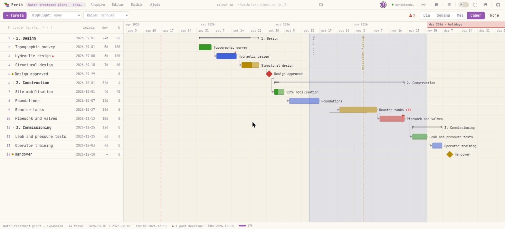

<p align="center"></p>

<h1 align="center">Perth.jl</h1>

<p align="center">
  <em>Cronogramas de projeto, do REPL ao navegador — sobre o mesmo dado, ao vivo.</em>
</p>

<p align="center">
  <a href="https://github.com/dantebertuzzi/Perth.jl/actions/workflows/CI.yml"></a>
  <a href="https://github.com/dantebertuzzi/Perth.jl/actions/workflows/Frontend.yml"></a>
  <a href="https://dantebertuzzi.github.io/Perth.jl/stable/"></a>
  <a href="https://github.com/dantebertuzzi/Perth.jl/releases"></a>
  
  <a href="LICENSE"></a>
</p>

<p align="center">
  <a href="README.md">English</a> ·
  <b>Português</b> ·
  <a href="README.es.md">Español</a> ·
  <a href="README.fr.md">Français</a> ·
  <a href="README.zh-CN.md">中文</a>
</p>

<p align="center"></p>

```julia
using Perth
Perth.run()          # abre http://localhost:8123 — o REPL continua livre
```

---

## Instalação

```julia
using Pkg
Pkg.add("Perth")
```

Opcionais, reconhecidos sozinhos quando carregados **antes** de `Perth.run()`:

| Pacote | O que acrescenta |
|---|---|
| `BusinessDays` | calendário de dias úteis (`set_calendar!(p, "Brazil")`) |
| `QRCoders` | QR code do link da rede, no terminal e na interface |
| `CairoMakie` (qualquer backend Makie) | `ganttplot` / `save_chart` para figuras estáticas |

O `using Perth` avisa quando sai uma versão nova — uma linha discreta embaixo
da dica de entrada, lida do registro de pacotes que **já está na sua máquina**,
sem nenhuma requisição de rede. Para perguntar na hora:

```julia
Perth.check_update()      # perth v0.12.0 → 0.13.0 available · ] up Perth
```

A etiqueta de versão na ponta direita da barra de status diz o mesmo no
navegador — `0.12.0 → 0.13.0` — no gantt e no kanban.

A resposta é tão recente quanto o seu último `] up`, que é quando o registro
local se atualiza — uma versão publicada há minutos demora a aparecer.
`PERTH_UPDATE_CHECK=0` desliga o aviso e a checagem em segundo plano;
`Perth.check_update()` continua respondendo quando você pergunta.

---

## Sessenta segundos

```julia
using Perth

p = create_project("ETA — ampliação")

topo    = add_task!(p, "Levantamento topográfico"; start = Date(2026, 9, 1), duration = 5,
                    assignee = "Ana", progress = 100)
projeto = add_task!(p, "Projeto hidráulico"; start = Date(2026, 9, 8), duration = 8,
                    assignee = "Ana", dependencies = [topo.id],
                    notes = "Conferir a **NBR 12216** antes de dimensionar.")
aprov   = add_task!(p, "Projeto aprovado"; start = Date(2026, 9, 29), milestone = true,
                    dependencies = [projeto.id])

# compromisso, não plano: o prazo nunca move a tarefa, ele deixa a folga negativa
add_task!(p, "Tubulação e válvulas"; start = Date(2026, 11, 12), duration = 10,
          deadline = Date(2026, 11, 20))

schedule!(p)                 # CPM: empurra as sucessoras para a data mais cedo
critical_path(p)             # a corrente sem folga
tasks(p)                     # linhas Tables.jl — direto para um DataFrame

Perth.run()                  # e agora olhe
```

Tudo isso também é um gesto no navegador, e as duas direções são ao vivo: a
página aberta percebe as mudanças feitas pelo REPL e recarrega sozinha.

> **Uma pegadinha que vale saber.** A variável que você guardou é uma foto. Depois
> de editar no navegador, peça o projeto de novo — `project(id)` devolve o que a
> interface acabou de salvar, enquanto `p` ainda tem o que tinha quando você
> atribuiu.

---

## Por que um pacote de Gantt *em Julia*?

Porque o navegador é só uma das vistas. O modelo e o motor são Julia comum, então
um plano é algo com que se calcula:

```julia
using DataFrames

df = DataFrame(tasks(p))
combine(groupby(df, :assignee), :duration => sum => :dias)

# o cronograma reage aos seus dados, e não o contrário
for linha in eachrow(medicoes)
    update_task!(p, linha.id; progress = linha.pct_feito)
end
schedule!(p)
```

Planilha não faz isso, e Gantt de mesa exige exportar antes.

---

## O que você ganha

### Planejamento

| | |
|---|---|
| **Motor CPM** | `schedule!`, `critical_path`, `slack`, `project_finish` |
| **Nivelamento de recursos** | `level!` — adia o que tem folga até ninguém passar da capacidade diária declarada, menor folga primeiro |
| **Dependências** | fim-início por padrão; `"SS:id"`, `"FF:id"` e defasagem `"id+3"` |
| **Dias úteis** | `set_calendar!(p, "Brazil")` — fim de semana e feriado deixam de contar |
| **EAP (WBS)** | dê um pai a uma tarefa; o pai vira resumo e agrega datas e avanço |
| **Prazos** | *compromisso*: nunca move a tarefa, deixa negativa a folga dela e de quem a alimenta |
| **Data fixa** | data de contrato que o `schedule!` não move — e avisa quando o plano deixou de caber |
| **Baseline** | congela o plano; as barras fantasma são o prometido, a diferença é a derrapagem |
| **Ordem manual** | `move_task!(p, id; parent, position)` — a ordem vence a data onde alguém escolheu |

### O gráfico

- **Arraste a barra** para mover a tarefa, a borda direita para redimensionar, e
  **arraste de uma barra à outra** para ligá-las: o ponto da direita liga ao que vem
  depois, o da esquerda ao que vem antes. Duplo clique na seta remove.
- **Arraste a linha para cima ou para baixo** e escolha a ordem à mão. Solta *no vão*
  entre duas linhas, ela assume aquela posição; solta *em cima* de uma tarefa, vira
  subtarefa dela — um gesto, dois destinos. A coluna **`#`** é essa ordem escrita;
  o tooltip dela traz o id da tarefa.
- **Zoom dia / semana / mês / caber** (`1`–`4`) e **Ctrl+roda**, que mantém parada a
  data sob o ponteiro. Trocar o zoom nunca te teletransporta para hoje.
- **Dias marcados** — duplo clique numa coluna da régua e dê um nome: uma linha
  vertical atravessando o gráfico, para a data que vale para todas as tarefas.
- **Meses marcados** — o mês inteiro pintado na régua do topo. Dito uma vez, lá em
  cima, em vez de repetido em cada tarefa de dentro.
- **Faixas do calendário** — sombreie um trecho com nome atrás do gráfico: um sprint,
  uma parada, a estação de chuvas. É anotação, nunca programação.
- **Raias** por pessoa ou setor, **resumos recolhíveis** (e o que você dobrou
  sobrevive ao F5), **filtro de destaque** — que escurece o que não casa, ou
  esconde de vez (*Só estes*, `O`) quando o plano já é grande o bastante para
  rolar pelo cinza ser a maior parte da leitura — e **modo apresentação**.
- **Notas com markdown**: o pontinho vermelho abre a nota, renderizando `**negrito**`,
  `*itálico*`, `` `código` ``, `~~riscado~~` e links.
- Nada no gráfico é escrito por cima de nada: as linhas abrem vão onde cruzam um
  rótulo, e os nomes deitados procuram altura livre. Existe um teste que mede isso,
  em navegador de verdade, em quatro zooms e duas densidades.

### Ler o plano

| | |
|---|---|
| **Curva S** | previsto × realizado, dito em número: *13% abaixo do previsto até hoje*, em trabalho e em dinheiro |
| **Carga** | quanto cada pessoa tem em cada dia (`workload`, `overallocations`) |
| **Capacidade** | `add_person!(p, "Ana"; capacity = 8)` e `effort` na tarefa: sobrecarga passa a ser *mais trabalho do que o dia aguenta*, e não *duas tarefas no mesmo dia* |
| **Estatísticas** | por pessoa e por setor: esforço, feito, dias ocupados, dias em dobro |
| **Avisos** | ciclo de dependência · prazo estourado · vencida · sobrecarga · atrás do baseline · *começa antes do que a dependência permite* |
| **Glossário** | Ajuda → *O que as palavras querem dizer*: folga, caminho crítico, baseline, P80 |

### Tirar de dentro

Exporte o projeto (`.perth.jl`), as tarefas (**CSV**), os marcos e prazos
(**iCalendar**), o gráfico (**PNG**) ou uma figura estática pelo Makie (`ganttplot`,
`save_chart`). E o **espelho em arquivo**: aponte o projeto para um caminho e cada
salvamento regrava o `.perth.jl` ali — o `git diff` mostra o que mudou no plano.

**E de volta para dentro.** Um CSV também entra — *Arquivo → Importar*, ou
`add_tasks!(p, "plano.csv")` no REPL, sem pacote de CSV para instalar. Uma linha por
tarefa, uma coluna `name`, e o que mais você tiver; `parent` e `dependencies` podem
citar a tarefa pelo **nome**, então a planilha que alguém escreveu de verdade entra
tão bem quanto o arquivo que o Perth exportou.

---

## Compartilhar um plano

Por padrão o `Perth.run()` só é alcançável desta máquina. A transmissão é um
**interruptor ao vivo**, não uma decisão de partida — pelo REPL, pelo botão de
transmitir na barra de menus, ou em *Arquivo → Share / QR…*:

```julia
Perth.run(share = true)          # imprime os links da rede (+ QR code com QRCoders)
Perth.share!()                   # liga a transmissão com o servidor no ar
Perth.share!(false)              # desliga; navegadores remotos caem na hora
Perth.key!("obra-2026")          # exige a chave de acesso de quem vem da rede
```

Cada máquina conectada aparece como um cursor etiquetado com nome e IP, estilo
pareação, e há um chat no canto.

### Um link que só mostra

Compartilhar era tudo ou nada: quem abria o link editava. O `view_key` é uma
**segunda chave**, que dá leitura e recusa escrita — o link que você manda para um
cliente, uma diretoria, a obra inteira:

```julia
Perth.run(share = true, key = "obra-2026", view_key = "obra-2026-ver")
Perth.view_key!("so-olhar")       # troca o link, ao vivo
Perth.view_key!()                 # acaba com ele
```

Quem recusa é o **servidor**, decidindo **pelo método** e não por uma lista de
rotas: rota nova amanhã já nasce recusada. Inclusive a porta que a interface não
usa — o chat do WebSocket persiste em disco e chega a todo mundo, então é escrita, e
deixá-lo aberto seria trocar a fechadura e deixar a janela aberta. Quem entra pelo
link de leitura aparece na lista de máquinas como um anel vazado: presente, sem
escrever.

> **Segurança.** Sem chave, qualquer um na rede que saiba a porta abre e edita todos
> os projetos. O link somente-leitura limita o que um navegador pode fazer; não é
> login, e é tão privado quanto a rede em que ele está. Nunca exponha a porta à
> internet.

<details>
<summary><b>Abrir a porta no firewall (Windows, rede corporativa)</b></summary>

A transmissão só ajuda se a máquina aceitar conexões na porta (8123 no gantt, 8150
no kanban). Em ordem de esforço:

1. **Aviso da primeira execução** — o Windows Defender pergunta sobre o `julia.exe`;
   marque **Redes privadas** e *Permitir acesso*. Exige direitos de administrador,
   então em máquina travada pode aparecer cinza ou não aparecer.
2. **Se foi dispensado** — menu Iniciar → "Permitir um aplicativo pelo Firewall" →
   *Alterar configurações* → *Permitir outro aplicativo…* → aponte para o
   `julia.exe` (rode `Sys.BINDIR` no REPL para achar) e marque *Particular*.
3. **Uma regra explícita**, que é o que o TI costuma preferir — PowerShell como
   administrador:
   ```powershell
   New-NetFirewallRule -DisplayName "Perth" -Direction Inbound `
     -Protocol TCP -LocalPort 8123 -Action Allow -Profile Domain,Private
   ```
4. **Confira o perfil da rede.** Regra de *Particular* não vale nada se o Windows
   classificou a rede do escritório como *Pública*. Em máquina de domínio, a rede do
   escritório costuma ser *Domínio*, que a regra acima já cobre.
5. **Sem administrador nenhum** — mande ao TI uma linha: *"Liberar TCP de entrada na
   porta 8123 para o `julia.exe` (perfil Domínio/Particular, só LAN — um plano
   interno em `http://<meu-ip>:8123`; nada exposto à internet)."*
6. **Firewall aberto e ainda inalcançável?** Wi-Fi de visitante costuma ter
   *isolamento de clientes*. Teste com `Test-NetConnection <ip> -Port 8123`; se
   falhar com o firewall aberto, use a rede cabeada ou a de funcionários.

No Linux: `sudo ufw allow 8123/tcp`. No macOS aparece um aviso na primeira execução,
como no Windows.

</details>

---

## Estimar sob incerteza (PERT)

Um número só para uma duração é um palpite de gravata. Dê três:

```julia
set_estimate!(p, fundacao.id, 9, 12, 22)      # otimista, mais provável, pessimista

pert(p)                                       # duração esperada e σ, por tarefa
pert_finish(p)                                # término: esperado, σ, P10/P50/P80/P90
finish_probability(p, Date(2026, 12, 10))     # a chance da data que você prometeu
pert_date(p, 0.8)                             # a data em que você acerta 4 vezes em 5
pert!(p)                                      # aplica (o + 4m + p)/6 como duração
```

As estimativas não movem nada sozinhas — quem as escreve no plano é o `pert!`, do
mesmo jeito que quem move datas é o `schedule!`.

### O número que a fórmula não conta

O PERT analítico supõe uma corrente crítica só. Quando várias correntes têm quase o
mesmo tamanho, a que atrasar vira a crítica — e o término escorrega para depois do
que qualquer fórmula prevê. O `pert_simulate` roda o motor inteiro milhares de vezes:

```julia
sim = pert_simulate(p; n = 10_000)
sim.p80        # a data que sobrevive a 80% dos futuros
```

A diferença entre `pert_finish(p).p80` e `sim.p80` é o preço de fingir que só existe
um caminho crítico.

---

## Kanban: um quadro compartilhado para o escritório

O `Perth.kanban()` sobe um segundo aplicativo, independente. Ele não encosta no
modelo de dados do gantt — o quadro é uma entidade própria, persistida como
`kanban.json` no diretório de dados.

```julia
Perth.kanban()                         # só esta máquina, como o Perth.run()
Perth.kanban(share = true)             # imprime os links da rede
Perth.kanban(share = true, key = "…")  # …e exige a chave de quem vem dela
Perth.kanban_share!(false)             # para de transmitir, quadro continua no ar
Perth.kanban_key!("…")                 # define/troca a chave com o quadro rodando

kanban_from_project!(p)                # transforma um plano em cartões
```

Autoridade no WebSocket de ponta a ponta: toda mudança é transmitida ao vivo,
arrastar um cartão anima na tela de todo mundo, e cada máquina aparece como um
cursor etiquetado ancorado a um *cartão*, não a um pixel — então ele sobrevive a
tamanhos de janela e níveis de zoom diferentes. Os cartões levam `#etiquetas`,
`**markdown**`, checklist, prazo, responsável, **limite de WIP** por coluna e
arquivo; uma coluna se ordena sob demanda por prazo, ou por lançamento com o mais
novo no topo — urgência, ou o que acabou de chegar. Um cartão ligado arrastado
para *done* conclui a tarefa no gantt, e vice-versa. Um cartão também **abre como documento** (`Shift+Enter`, ou pelo editor do
próprio cartão — um tablet não tem Shift): uma
descrição com listas e blocos de código, e capturas de tela coladas direto com
`Ctrl+V` — reduzidas no navegador, guardadas ao lado do quadro e endereçadas pelo
conteúdo, então a mesma imagem colada cinco vezes é um arquivo só.
`Ctrl+Z` / `Ctrl+Shift+Z` desfazem o que **você** fez, sem reverter o que
um colega fez depois.

O **host** pode restringir o que cada máquina faz — *Board → Permissions…* é uma
matriz de 21 ações de cartão e coluna contra cada IP que já se conectou. A restrição
vale **no servidor**: o cliente não escapa dela falando direto com o WebSocket, e a
interface apenas esconde o que está negado.

E o REPL opera no mesmo quadro, transmitindo ao vivo para todos os navegadores:

```julia
kanban_add_card!("backlog", "Publicar a v1.0")
kanban_move_card!(id, "doing")
kanban_alias!("192.168.0.23", "Paulo")   # um nome para a máquina, na tela de todos
kanban_cards() |> DataFrame              # linhas (coluna, id, texto)
kanban_log()                             # quem mudou o quê, e quando
kanban_chat!("quadro pronto")            # o painel de chat, pelo REPL
Perth.kanban_stop()
```

> **Segurança.** A matriz de permissões restringe o que uma máquina **conectada**
> pode fazer; ela não barra a conexão, e a identidade é só um endereço IP
> (falsificável numa rede em que você não confia). Trate-a como redução de estrago,
> não como autenticação.

<details>
<summary><b>Zerar o quadro</b></summary>

O quadro inteiro mora em dois arquivos, então zerar é: parar o servidor, apagá-los,
subir de novo.

```julia
Perth.kanban_stop()                       # pare primeiro — o servidor mantém o
                                          # quadro em memória e regrava o arquivo a
                                          # cada operação
datadir = joinpath(homedir(), ".perth")   # ou o seu PERTH_DATA_DIR / data_dir
rm(joinpath(datadir, "kanban.json"); force = true)        # o quadro
rm(joinpath(datadir, "kanban-log.jsonl"); force = true)   # o log de atividades
Perth.kanban(share = true)                # quadro novo: backlog / doing / done
```

Apagar o log é opcional — mas, se você o mantiver, o painel de Atividade vai mostrar
histórico que fala de um quadro que não existe mais. Para **guardar** o quadro velho
em vez de apagá-lo, renomeie o arquivo e renomeie de volta quando quiser; para
começar um quadro **separado** sem mexer neste, aponte o servidor para outra pasta:
`Perth.kanban(share = true, data_dir = "/caminho/do/novo-quadro")`.

</details>

---

## Teclado

| | |
|---|---|
| `↑` `↓` | move a seleção pelas linhas visíveis |
| `←` `→` | recolhe um resumo / abre — numa folha, `←` sobe para o pai |
| `Home` `End` · `PageUp` `PageDown` | pontas do plano · uma tela |
| `N` · `Enter` · `Del` · `Ctrl+D` | nova · editar · excluir · duplicar a seleção |
| `Ctrl+clique` · `Shift+clique` · `Shift+↑` `↓` | somar uma à seleção · pegar o intervalo · estendê-lo |
| `Ctrl+A` · `Ctrl+E` | selecionar todas as visíveis · editar a seleção (datas, responsável, cor) |
| `Ctrl+Z` · `Ctrl+Shift+Z` | desfazer · refazer |
| `S` · `C` · `R` | programar automaticamente · caminho crítico · recursos |
| `1` `2` `3` `4` · `Ctrl+roda` | zoom dia / semana / mês / caber · zoom sob o ponteiro |
| `T` · `/` · `D` · `P` | ir para hoje · buscar tarefa · modo escuro · apresentação |

---

## Onde as coisas ficam

Cada projeto é um arquivo JSON em `~/.perth` (ou `$PERTH_DATA_DIR`, ou
`Perth.run(data_dir = ...)`). JSON é o formato da máquina; **`.perth.jl` é o formato
de intercâmbio para gente e para controle de versão**:

```julia
Perth.save(p, "planos/eta.perth.jl")         # fonte Julia legível e diffável
q = Perth.load("planos/eta.perth.jl")
set_file_path!(p, "planos/eta.perth.jl")     # espelho: cada salvamento regrava
```

O `Perth.load` usa um **leitor restrito**, não `eval`: só `Project`, `GanttTask`,
`Person`, `Band`, `Marker`, `MonthMark`, `Date` e `DateTime` podem ser construídos, e
qualquer outra chamada é recusada. Um plano que chegou por e-mail não roda código.

---

## Arquitetura

```
REPL  ──►  AppState (projetos em memória + contador de revisão)  ◄──  API HTTP
                     │                                                  │
              JSON em disco                              navegador (JS puro)
              espelho .perth.jl                          + presença por WebSocket
```

Sem framework, sem etapa de build, sem `node_modules`: o frontend é JS e CSS puros
servidos pelo mesmo processo Julia. Três suítes seguram a barra — Julia
(`Pkg.test()`), jsdom para lógica de DOM, e um Chrome sem interface de verdade para
geometria, cadeia de eventos e medição de sobreposição.
---

## Limitações conhecidas

- **Não é multiusuário por identidade.** Todo mundo na rede compartilha os mesmos
  projetos; a chave de acesso é uma porta, não um login.
- **Local por opção.** Sem nuvem, sem contas, sem sincronização entre máquinas além
  da rede local — o arquivo é a sincronização.
- **O nivelamento é uma heurística, e precisa de capacidade declarada.** `level!`
  move primeiro as tarefas com mais folga — uma regra defensável, não o ótimo, porque
  o ótimo é NP-difícil. Só mexe em quem tem `capacity` declarada, e um plano com mais
  trabalho do que capacidade volta com os dias que continuam sem caber marcados, em
  vez de rearranjado caladamente.

O que vem a seguir está no [ROADMAP.md](ROADMAP.md), com o raciocínio de cada item.
Issues e contribuições são bem-vindas — inclusive me contar que um plano seu quebrou
alguma coisa.

---

<p align="center">
  <a href="CHANGELOG.md">Changelog</a> ·
  <a href="ROADMAP.md">Roadmap</a> ·
  <a href="https://dantebertuzzi.github.io/Perth.jl/stable/">Documentação</a> ·
  MIT
</p>
