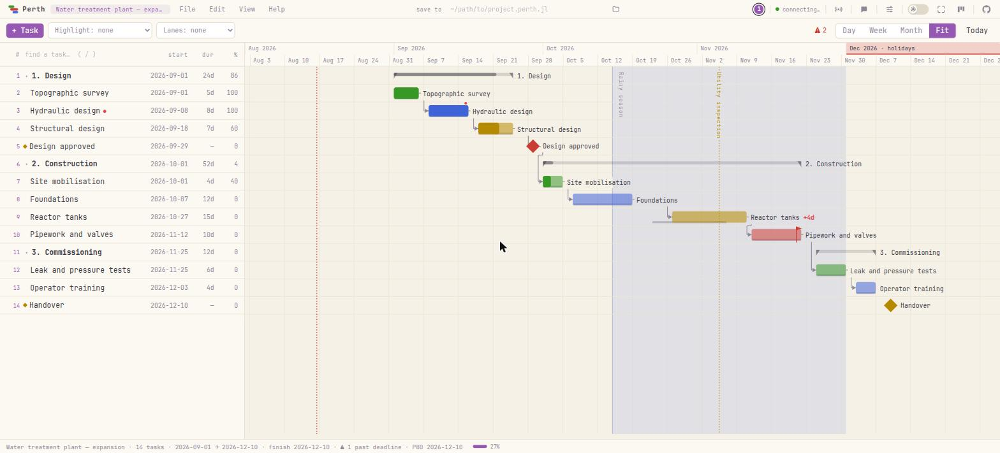

<p align="center"></p>

<h1 align="center">Perth.jl</h1>

<p align="center">
  <em>项目进度计划，从 REPL 到浏览器 —— 同一份数据，实时同步。</em>
</p>

<p align="center">
  <a href="https://github.com/dantebertuzzi/Perth.jl/actions/workflows/CI.yml"></a>
  <a href="https://github.com/dantebertuzzi/Perth.jl/actions/workflows/Frontend.yml"></a>
  <a href="https://dantebertuzzi.github.io/Perth.jl/stable/"></a>
  <a href="https://github.com/dantebertuzzi/Perth.jl/releases"></a>
  
  <a href="LICENSE"></a>
</p>

<p align="center">
  <a href="README.md">English</a> ·
  <a href="README.pt-BR.md">Português</a> ·
  <a href="README.es.md">Español</a> ·
  <a href="README.fr.md">Français</a> ·
  <b>中文</b>
</p>

<p align="center"></p>

```julia
using Perth
Perth.run()          # 打开 http://localhost:8123 —— REPL 依然可用
```

---

## 安装

```julia
using Pkg
Pkg.add("Perth")
```

可选依赖，只要在 `Perth.run()` **之前**加载就会自动生效：

| 包 | 带来什么 |
|---|---|
| `BusinessDays` | 工作日日历（`set_calendar!(p, "Brazil")`） |
| `QRCoders` | 局域网链接的二维码，终端和界面里都有 |
| `CairoMakie`（任意 Makie 后端） | `ganttplot` / `save_chart` 输出静态图 |

---

## 六十秒上手

```julia
using Perth

p = create_project("水处理厂 —— 扩建")

survey  = add_task!(p, "地形测量"; start = Date(2026, 9, 1), duration = 5,
                    assignee = "Ana", progress = 100)
design  = add_task!(p, "水力设计"; start = Date(2026, 9, 8), duration = 8,
                    assignee = "Ana", dependencies = [survey.id],
                    notes = "定尺寸前先查 **NBR 12216**。")
approve = add_task!(p, "设计通过"; start = Date(2026, 9, 29), milestone = true,
                    dependencies = [design.id])

# 这是承诺，不是计划：期限从不挪动任务，它让浮时变成负数
add_task!(p, "管道与阀门"; start = Date(2026, 11, 12), duration = 10,
          deadline = Date(2026, 11, 20))

schedule!(p)                 # CPM：把后继任务推到最早可行日期
critical_path(p)             # 没有浮时的那条链
tasks(p)                     # Tables.jl 行 —— 可直接送进 DataFrame

Perth.run()                  # 然后打开看看
```

上面每一件事在浏览器里也都是一个手势，而且两个方向都是实时的：打开的页面会发现
REPL 端的改动并自动重新加载。

> **一个值得知道的细节。** 你先前绑定的变量是一张快照。在浏览器里改过之后，请重新
> 取一次项目 —— `project(id)` 返回界面刚保存的内容，而 `p` 里还是你赋值那一刻的东西。

---

## 为什么用 *Julia* 写甘特图包？

因为浏览器只是其中一个视图。模型和引擎都是普通的 Julia，于是一份计划变成了可以拿来
计算的东西：

```julia
using DataFrames

df = DataFrame(tasks(p))
combine(groupby(df, :assignee), :duration => sum => :天数)

# 让进度计划跟着你的数据走，而不是反过来
for 行 in eachrow(实测)
    update_task!(p, 行.id; progress = 行.完成百分比)
end
schedule!(p)
```

电子表格做不到这一点，桌面版甘特图则要求你先导出。

---

## 你会得到什么

### 计划

| | |
|---|---|
| **CPM 引擎** | `schedule!`、`critical_path`、`slack`、`project_finish` |
| **依赖** | 默认完成-开始；还有 `"SS:id"`、`"FF:id"` 和延时 `"id+3"` |
| **工作日** | `set_calendar!(p, "Brazil")` —— 周末与节假日不再计入 |
| **WBS** | 给任务设一个父任务；父任务变成摘要，日期和进度自动汇总 |
| **期限** | 一种*承诺*：从不挪动任务，而是让它以及上游的浮时变成负数 |
| **钉住的开始日** | 合同日期，`schedule!` 不会动它 —— 计划装不下时会明说 |
| **基线** | 冻结计划；虚影条是当初的承诺，两者之差就是偏移 |
| **手工排序** | `move_task!(p, id; parent, position)` —— 有人排过的地方，顺序胜过日期 |

### 图表

- **拖动条形**移动任务，拖右边缘改工期，**从一根条拖到另一根**建立依赖：右端的点
  连向后续任务，左端的点连向前置任务。双击箭头即可删除。
- **上下拖动一行**，用手指定顺序。落在两行之间的**空隙**里，它取那个位置；落在某个
  任务**上面**，它成为该任务的子任务 —— 一个手势，两个去处。左侧的 **`#` 列**就是这个
  顺序，悬停可看到任务 id。
- **日 / 周 / 月 / 适应**四档缩放（`1`–`4`），以及 **Ctrl+滚轮**，缩放时指针下的日期
  保持不动。换缩放级别不会再把你传送回今天。
- **标记日** —— 双击日期刻度上的一列并命名：一条纵贯全图的竖线，用于对所有任务都
  重要的那一天。
- **标记月** —— 整个月在顶部刻度上着色。在上面说一次，而不是在里面的每个任务上重复。
- **日历色带** —— 在图后为一段时间加底色并命名：一个冲刺、一次停工、雨季。它是标注，
  从不参与排程。
- 按人或团队分的**泳道**、可折叠的 **WBS 摘要**（折叠状态还能挺过刷新）、**高亮筛选**
  和**演示模式**。
- **支持 markdown 的备注**：红点打开备注，渲染 `**粗体**`、`*斜体*`、`` `代码` ``、
  `~~删除线~~` 和链接。
- 图上没有任何东西被写在别的东西上面：线遇到标签会让开一段空隙，竖排的名字会自己找
  空位。这一点有测试在真实浏览器里度量，覆盖四种缩放和两种密度。

### 读懂计划

| | |
|---|---|
| **S 曲线** | 计划 × 实际 —— 两条曲线的差距是以工作量而非天数计的延误 |
| **负荷** | 每个人每天有多少活（`workload`、`overallocations`） |
| **统计** | 按人、按团队：工作量、已完成、忙碌天数、重复安排的天数 |
| **警告** | 依赖成环 · 超过期限 · 逾期 · 超负荷 · 落后于基线 · *早于依赖允许的时间开始* |
| **词汇表** | 帮助 → *这些词是什么意思*：浮时、关键路径、基线、P80 等等 |

### 把成果拿出去

导出项目（`.perth.jl`）、任务（**CSV**）、里程碑与期限（**iCalendar**）、图表
（**PNG**），或通过 Makie 生成静态图（`ganttplot`、`save_chart`）。还有**文件镜像**：
给项目指定一个路径，之后每次保存都会把 `.perth.jl` 重写到那里 —— `git diff` 就能看出
计划改了什么。

---

## 分享一份计划

默认情况下 `Perth.run()` 只能从本机访问。分享是一个**实时开关**，而不是启动时才能决定
的事 —— 可以在 REPL 里、在菜单栏的广播按钮上，或在*文件 → Share / QR…* 中切换：

```julia
Perth.run(share = true)          # 打印局域网链接（装了 QRCoders 还会打印二维码）
Perth.share!()                   # 服务器已在运行时开始广播
Perth.share!(false)              # 停止；远端浏览器立即断开
Perth.key!("obra-2026")          # 要求来自网络的机器提供访问密钥
```

每台连上的机器都会显示为带名字和 IP 的光标标签，像结对编程一样，角落里还有聊天。

### 一个只能看的链接

以前分享是全有或全无：打开链接的人就能编辑。`view_key` 是**第二把钥匙**，给读、拒写
—— 正是你发给客户、发给领导、发给整个工地的那个链接：

```julia
Perth.run(share = true, key = "obra-2026", view_key = "obra-2026-view")
Perth.view_key!("just-looking")   # 实时更换
Perth.view_key!()                 # 取消
```

拒绝的是**服务器**，而且是**按方法**判断，不是按路由清单：明天新加的路由默认就被拒绝。
这也包括界面并不使用的那扇门 —— 在线状态 socket 上的聊天会写入磁盘并广播给所有人，
所以它是写操作；把它敞着，等于换了锁却把窗户留着。通过只读链接进来的人会出现在已连接
机器里，显示为一个空心环：在场，不写。

> **安全。** 没有密钥时，同一网络里知道端口的人都能打开并编辑全部项目。只读链接限制的
> 是浏览器能做什么，它不是登录；它的私密程度等同于它所在的网络。切勿把端口暴露到公网。

<details>
<summary><b>在防火墙上开放端口（Windows，企业网络）</b></summary>

只有当机器允许该端口的入站连接（甘特图 8123，看板 8150），分享才有意义。按麻烦程度排序：

1. **首次运行的提示** —— Windows Defender 会询问 `julia.exe`；勾选**专用网络**并
   *允许访问*。这需要管理员权限，在受控机器上可能是灰的，或者根本不出现。
2. **如果提示被关掉了** —— 开始菜单 →「允许应用通过 Windows 防火墙」→ *更改设置* →
   *允许其他应用…* → 指向 `julia.exe`（在 REPL 里运行 `Sys.BINDIR` 可以找到），勾选
   *专用*。
3. **一条显式规则**，这通常是 IT 更喜欢的做法 —— 以管理员身份运行 PowerShell：
   ```powershell
   New-NetFirewallRule -DisplayName "Perth" -Direction Inbound `
     -Protocol TCP -LocalPort 8123 -Action Allow -Profile Domain,Private
   ```
4. **检查网络配置文件。** 如果 Windows 把办公网络归为*公用*，那么*专用*规则毫无作用。
   加入域的机器上，办公网络通常是*域*配置文件，上面的规则已经涵盖。
5. **完全没有管理员权限** —— 给 IT 发一句话：「请为 `julia.exe` 放行 8123 端口的入站
   TCP（域/专用配置文件，仅限局域网 —— 内部计划在 `http://<我的IP>:8123`；不对公网
   暴露任何东西）。」
6. **防火墙开了还是连不上？** 访客 Wi-Fi 常有*客户端隔离*。用
   `Test-NetConnection <ip> -Port 8123` 测一下；若在防火墙已开的情况下失败，就改用
   有线网络或员工网络。

Linux 上是 `sudo ufw allow 8123/tcp`；macOS 与 Windows 类似，首次运行时会提示。

</details>

---

## 在不确定中做估计（PERT）

给工期只填一个数字，是穿着西装的猜测。请给三个：

```julia
set_estimate!(p, foundations.id, 9, 12, 22)   # 乐观、最可能、悲观

pert(p)                                       # 每个任务的期望工期和 σ
pert_finish(p)                                # 完工：期望、σ、P10/P50/P80/P90
finish_probability(p, Date(2026, 12, 10))     # 你承诺的那个日期有多大把握
pert_date(p, 0.8)                             # 五次里对四次的那个日期
pert!(p)                                      # 把 (o + 4m + p)/6 写成工期
```

估计本身不会挪动任何东西 —— 把它们写进计划的是 `pert!`，正如挪动日期的是 `schedule!`。

### 公式不会告诉你的那个数

解析式 PERT 假设只有一条关键链。当多条链长度接近时，谁拖延谁就变成关键 —— 完工日期
会比任何公式预测的更靠后。`pert_simulate` 会把整个引擎跑上千次：

```julia
sim = pert_simulate(p; n = 10_000)
sim.p80        # 在 80% 的未来里都能守住的日期
```

`pert_finish(p).p80` 与 `sim.p80` 之间的差，就是假装只有一条关键路径要付的代价。

---

## 看板：办公室共用的一块板

```julia
Perth.kanban(share = true)               # 局域网上的一块看板
kanban_from_project!(p)                  # 把计划变成卡片
```

端到端以 WebSocket 为准：每一次改动都实时广播。卡片支持 `#标签`、`**markdown**`、
清单、截止日期和负责人；把关联卡片拖到 *done* 会完成甘特图里的对应任务，反之亦然。
按机器的权限、撤销/重做、聊天，以及与上面相同的访问密钥模型。

---

## 键盘

| | |
|---|---|
| `↑` `↓` | 在可见行之间移动选择 |
| `←` `→` | 折叠摘要 / 展开 —— 在叶任务上，`←` 跳到父任务 |
| `Home` `End` · `PageUp` `PageDown` | 计划两端 · 翻一屏 |
| `N` · `Enter` · `Del` · `Ctrl+D` | 新建 · 编辑 · 删除 · 复制任务 |
| `Ctrl+Z` · `Ctrl+Shift+Z` | 撤销 · 重做 |
| `S` · `C` · `R` | 自动排程 · 关键路径 · 资源负荷 |
| `1` `2` `3` `4` · `Ctrl+滚轮` | 缩放 日/周/月/适应 · 指针处缩放 |
| `T` · `/` · `D` · `P` | 跳到今天 · 查找任务 · 深色模式 · 演示模式 |

---

## 东西存在哪里

每个项目是 `~/.perth` 下的一个 JSON 文件（也可用 `$PERTH_DATA_DIR` 或
`Perth.run(data_dir = ...)`）。JSON 是给机器看的格式；**`.perth.jl` 是给人和版本控制
看的交换格式**：

```julia
Perth.save(p, "plans/plant.perth.jl")        # 可读、可 diff 的 Julia 源码
q = Perth.load("plans/plant.perth.jl")
set_file_path!(p, "plans/plant.perth.jl")    # 镜像：每次保存都会重写它
```

`Perth.load` 用的是**受限解析器**，不是 `eval`：只允许构造 `Project`、`GanttTask`、
`Person`、`Band`、`Marker`、`MonthMark`、`Date` 和 `DateTime`，其他调用一律拒绝。别人
用邮件发给你的计划无法执行代码。

---

## 架构

```
REPL  ──►  AppState（内存中的项目 + 版本计数器）  ◄──  HTTP API
                     │                                    │
              磁盘上的 JSON                     浏览器（原生 JS）
              .perth.jl 镜像                    + WebSocket 在线状态
```

没有框架，没有构建步骤，没有 `node_modules`：前端就是由同一个 Julia 进程提供的纯 JS 和
CSS。三套测试守着它 —— Julia（`Pkg.test()`）、用于 DOM 逻辑的 jsdom，以及一个真正的
无界面 Chrome，用来测几何、事件链和元素重叠。

---

## 已知限制

- **不是按身份区分的多用户系统。** 网络上的每个人共享同一批项目；访问密钥是一道门，
  不是登录。
- **本地优先是刻意的。** 没有云、没有账号，局域网之外也没有机器间同步 —— 文件就是同步。
- **资源平衡不是自动的。** Perth 会报告超负荷，但不会替你解决。

接下来要做什么写在 [ROADMAP.md](ROADMAP.md) 里，每一条都附了理由。欢迎提 issue 和贡献
代码 —— 也欢迎告诉我，你的某份计划把哪里弄坏了。

---

<p align="center">
  <a href="CHANGELOG.md">Changelog</a> ·
  <a href="ROADMAP.md">Roadmap</a> ·
  <a href="https://dantebertuzzi.github.io/Perth.jl/stable/">文档</a> ·
  MIT
</p>
